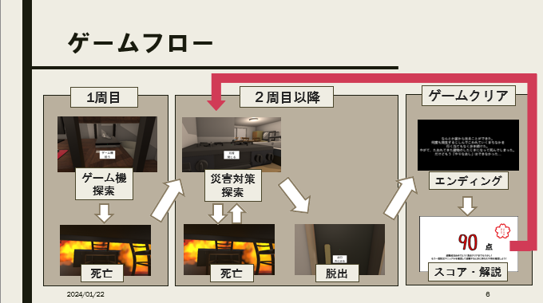
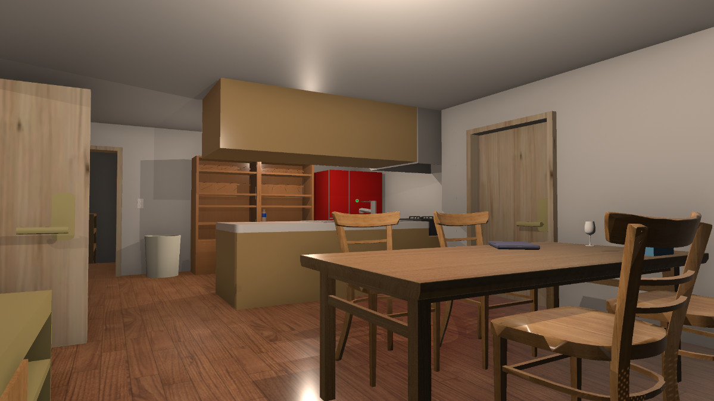
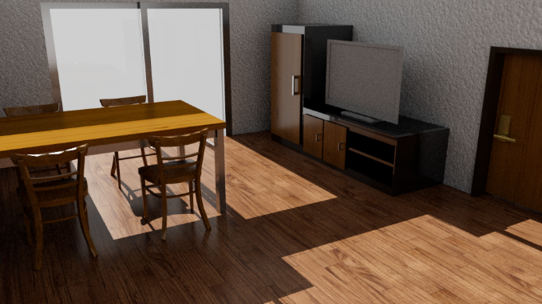
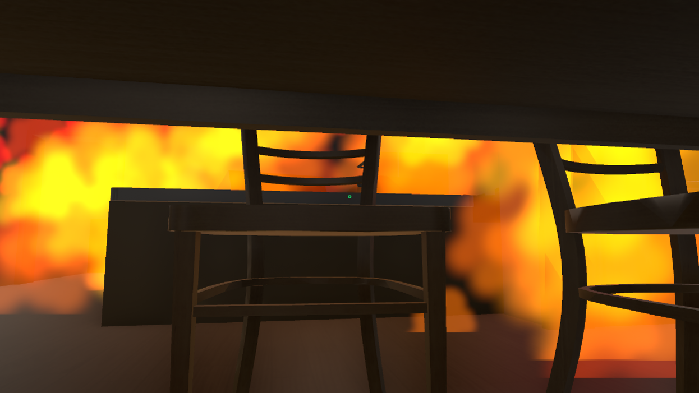

# 隠遊 〜災害脱出3Dゲーム〜

## 🎮 概要

『隠遊』は、留守番中の小学生がゲーム機を探す日常の中で、突如として発生する地震と火災に直面する、**一人称視点の災害脱出体験型ゲーム**です。

序盤は家の中を探索し、遊びを目的として動くプレイヤー。  
しかし中盤以降は状況が一変し、「生き延びる」ことが目的に変わります。  
本作では、「災害は突然起こるもの」という現実の厳しさと、「その時どう行動すべきか」を、ゲームを通じて自然に体験できる構成になっています。

---

## 🗂 基本情報

| 項目 | 内容 |
|------|------|
| タイトル | 隠遊（In-Yuu） |
| ジャンル | 理不尽災害脱出ゲーム |
| プレイ人数 | 1人 |
| プレイ時間目安 | 約3〜5分（マルチエンディング・複数回プレイ想定） |
| 開発環境 | Unity 6000.0.46f1 / C# / GitHub |
| 対応ハード | PC（マウス＆キーボード / ゲームパッド） |
| Web版 | [UnityRoomにて公開中](https://unityroom.com/games/kakureasobi) |

---

## 🧑‍💻 制作メンバー

| 担当 | GitHubアカウント |
|------|------------------|
| 🎮 プログラマー | [totsuka0405](https://github.com/totsuka0405), [nakashu195](https://github.com/nakashu195) |
| 🎨 モデリング | [KeiB782](https://github.com/KeiB782), [suika777](https://github.com/suika777), [TK220168ishizaki](https://github.com/TK220168ishizaki), [tk220538](https://github.com/tk220538) |
| 💡 企画 | [tk220538](https://github.com/tk220538), [KeiB782](https://github.com/KeiB782) |

---

## 🧭 ゲームの流れ

1. ゲーム機を探す探索フェーズ（1周目）
2. 突然の地震発生と火災による緊急フェーズへ
3. 十分な備えがあれば脱出可能、なければ死亡
4. 2周目以降は防災対策を踏まえた進行が可能
5. 結果に応じて異なるエンディング・スコア評価が表示される

---

## 🔥 ストーリー・演出のポイント

- 主人公は母親の留守中にゲーム機を探す小学生
- 災害（地震・火災）は予告なく突然発生
- 現実同様「知識や準備があるか」で生死が分かれる
- 子ども視点の不自由さと不安感を意図的に演出

---

## 🛠 主なゲーム要素

- アイテム探索：ゲーム機、防災バッグ、懐中電灯、ホイッスルなど
- インタラクション：扉、家具、ブレーカー、スマートフォン
- 災害対応：地震の揺れ、火災の拡大、避難ルートの選択
- 周回要素：1回目の死を踏まえた2周目以降の「学び」
- エンディング：行動によって7つのマルチエンディングに分岐

---

## 🧰 実装機能（構成スクリプト例）

### 📋 ゲーム制御・UI

- `GameManager.cs`：時間・イベント・フラグ制御の中枢
- `UIManager.cs`：UIパネル管理と動的表示
- `SoundManager.cs`：BGM/SEのループ・一括再生
- `RetryButton.cs`：リトライ用UI

### 👤 プレイヤー操作・状態

- `CharacterMove.cs`：移動・視点・アイテム使用処理
- `ItemUse.cs`：レイキャストによるインタラクト
- `PlayerDeath.cs`：死亡演出（フェード＋カメラ回転）

### 🧯 災害イベント

- `ShakeHouse.cs`：Rigidbodyによる家の揺れ表現
- `FireEvents.cs`：段階的に火災を展開
- `Breaker.cs` / `LightOnOff.cs`：照明と連動する停電演出

### 🧳 アイテムと装備

- `Item.cs` / `ItemBox.cs` / `Slot.cs`：インベントリ管理
- `PickupObj.cs`：アイテム取得処理
- `HandLight.cs`, `HandItemPhone.cs`：装備中アイテムの動作

### 🧱 演出・演習用UI

- `EndPanels.cs` / `EndVideo.cs`：エンディング映像と結果表示
- `SelfSpeak.cs`, `Memo.cs`, `BousaiBook.cs`：防災情報提示
- `BrightnessController.cs`：PostProcessによる明度調整

---

## 📸 スクリーンショット

| シーン | 説明 |
|-------|------|
|  | ゲーム機を探す平和な序盤 |
|  | 家具・内装モデルの設計（光の演出あり） |
|  | 火災が迫る中、机の下に隠れて一時的に回避 |

---

## 🎯 工夫した点

- **段階的災害演出**：視覚・音響でリアルな災害状況を表現
- **スコア＋講評システム**：プレイ結果に応じて学びと評価を提示
- **プレイヤーの視点制御・インタラクションの簡素化**：初心者にも配慮
- **教育性の付加**：防災の知識や「備えることの重要性」を自然に体感

---

## 📉 改善点・反省

- UIの一貫性や視認性に改善の余地あり
- 家具・小物のモデリング統一性に課題
- 一部アイテムやギミックの導線が不明瞭
- ストッパー要素の未完成
- パズル性の導入不足（アイテム全回収の楽しさが薄い）

---

## 🔮 今後の展望

- 複数人プレイ／協力避難モードの試験導入
- 災害バリエーションの追加（台風・津波など）
- WebGL版・VR対応による体験の拡張
- 外部評価を基にしたUI／ナビゲーション改善
- 防災教育教材としての実証実験への応用

---

## ▶ 実行方法

1. Unity Hubで本プロジェクトを開く  
2. `Assets/Scenes/MainGameScene.unity` を開いて再生（Play）

---

## 📜 ライセンス

本プロジェクトは教育・ポートフォリオ目的で制作されています。  
無断転載・商用利用はお控えください。

---

## 📫 お問い合わせ

- GitHub: 各メンバーのアカウントをご参照ください  
- ご意見・ご質問・プレイ体験の感想など、お気軽にお寄せください。
